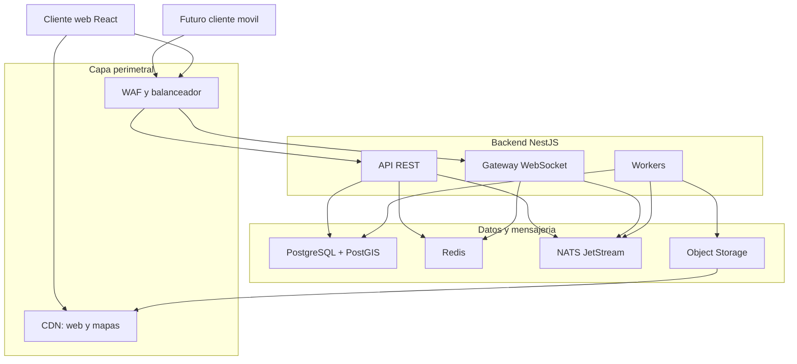
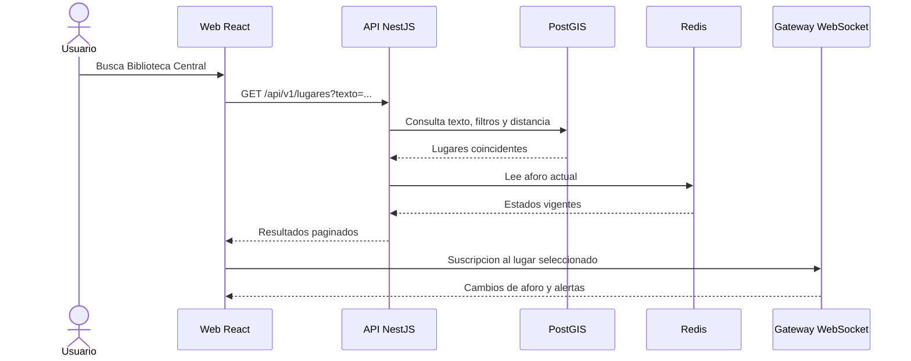
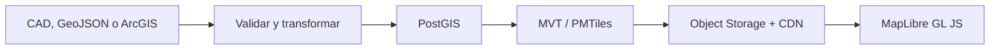

# Arquitectura de MAPUC

## 1. Proposito

Este documento define la arquitectura de MAPUC, una plataforma web de orientacion y consulta del campus PUCP. La solucion debe permitir buscar lugares, aplicar filtros, visualizar aforo, calcular rutas, enviar reportes y habilitar chats temporales cuando una zona presente alta afluencia, aforo lleno o una incidencia.

La primera version sera web. Una futura aplicacion movil reutilizara los mismos contratos HTTP y WebSocket; no se desarrollara un backend independiente para mobile.

## 2. Decision arquitectonica

MAPUC usara una **arquitectura cliente-servidor distribuida**.

- **Cliente web:** React consume la API y renderiza el mapa.
- **Servidor de negocio:** NestJS atiende autenticacion, lugares, busquedas, filtros, reportes, administracion y consultas geoespaciales.
- **Servidor de tiempo real:** una aplicacion NestJS independiente mantiene WebSockets para chat, alertas y cambios de aforo.
- **Procesadores en segundo plano:** workers NestJS procesan eventos, notificaciones e importaciones cartograficas.
- **Datos:** PostgreSQL con PostGIS conserva la informacion persistente; Redis mantiene datos temporales y NATS distribuye eventos.
- **Contenido estatico:** una CDN entrega el frontend y las teselas vectoriales del mapa.

NestJS no cambia el modelo cliente-servidor: es el framework con el que se implementa la parte servidor. Su sistema de modulos, controladores, providers, guards e inyeccion de dependencias organiza el backend.

## 3. Vista general

## 4. Estilo del backend

### 4.1 Monolito modular con despliegues especializados

El dominio se mantiene en un solo repositorio NestJS y se divide por modulos funcionales. Para escalar de forma independiente, el repositorio produce tres aplicaciones:

| Aplicacion | Responsabilidad | Escalamiento |
|---|---|---|
| `api` | REST, busqueda, CRUD, reportes y administracion | Por solicitudes HTTP, CPU y latencia |
| `realtime` | WebSocket, chat, presencia, aforo y alertas | Por conexiones, mensajes y memoria |
| `workers` | Eventos, notificaciones, outbox e importacion de mapas | Por longitud de colas y tiempo de proceso |

Esto evita comenzar con muchos microservicios, pero permite escalar la parte de tiempo real sin duplicar toda la API. Los tres procesos reutilizan librerias de dominio y contratos internos.

### 4.2 Arquitectura hexagonal por modulo

Cada modulo relevante se separa en:

- `domain`: entidades, value objects, reglas y eventos de dominio.
- `application`: casos de uso y puertos de entrada/salida.
- `infrastructure`: PostgreSQL, Redis, NATS, storage y proveedores externos.
- `presentation`: controladores HTTP, gateways WebSocket y DTO de transporte.

Las reglas del dominio no deben importar NestJS, TypeORM, Redis, NATS ni objetos HTTP. NestJS se utiliza para ensamblar dependencias en los modulos.

### 4.3 Modulos funcionales

- `identidad`: perfil local, roles y relacion con el proveedor OIDC.
- `campus`: campus, edificios, pisos y servicios.
- `mapas`: versiones, importacion, capas y publicacion de teselas.
- `lugares`: informacion, horarios, categorias y accesibilidad.
- `busqueda`: texto, filtros y consultas geoespaciales.
- `rutas`: grafo peatonal, rutas accesibles y transiciones entre pisos.
- `aforo`: estado actual, lecturas e historial.
- `chat`: salas temporales, mensajes, moderacion y limites.
- `reportes`: aforo incorrecto, incidencias y evidencias.
- `alertas`: avisos oficiales o generados desde reportes validados.
- `notificaciones`: avisos dentro de la aplicacion y preferencias.
- `favoritos`: lugares guardados, vistos y busquedas recientes.
- `administracion`: operaciones reservadas, metricas y auditoria.

## 5. Comunicacion

### 5.1 HTTP REST

REST se usa para operaciones transaccionales y consultas que no requieren una conexion permanente:

- autenticacion OIDC y perfil;
- lugares, categorias, horarios y servicios;
- busquedas y filtros;
- calculo y detalle de rutas;
- lugares guardados e historial;
- creacion y seguimiento de reportes;
- administracion.

La API se versiona bajo `/api/v1`. Las listas deben usar paginacion por cursor cuando el orden pueda cambiar y paginacion por pagina solo en tablas administrativas estables.

### 5.2 WebSocket

WebSocket se usa exclusivamente para:

- actualizaciones de aforo;
- alertas activas;
- chat temporal por lugar;
- presencia aproximada en una sala;
- confirmaciones asincronas relevantes.

El cliente se suscribe solo a los lugares o zonas visibles/seleccionados. No se transmiten todos los eventos del campus a cada conexion.

### 5.3 Eventos internos

NATS JetStream desacopla los procesos NestJS. Algunos eventos son:

- `aforo.actualizado`;
- `reporte.creado`;
- `reporte.validado`;
- `alerta.publicada`;
- `chat.habilitado`;
- `mensaje.reportado`;
- `mapa.publicado`.

Los eventos que nacen junto con una escritura en PostgreSQL usan **Transactional Outbox** para evitar perder eventos entre la confirmacion de la transaccion y su publicacion.

## 6. Flujo principal

## 7. Cartografia

CAD, GeoJSON y ArcGIS son fuentes de entrada, no el formato de entrega masiva al navegador.

- El mapa base se publica como teselas vectoriales `MVT/PMTiles` y se cachea en CDN.
- GeoJSON se reserva para capas dinamicas pequenas o intercambio de datos.
- PostGIS resuelve busquedas por cercania, intersecciones y filtros espaciales.
- Las capas dinamicas de aforo y alertas contienen identificadores y estados ligeros, no geometria completa repetida.
- La red de rutas peatonales se representa mediante nodos y tramos, incluyendo accesibilidad y cambios de piso.

## 8. Persistencia y cache

### PostgreSQL + PostGIS

Es la fuente de verdad para usuarios locales, lugares, geometria, horarios, rutas, reportes, alertas, historial y auditoria.

- Indices `GiST` para columnas geograficas.
- Indices B-tree para claves foraneas, estados y fechas.
- `pg_trgm` y Full Text Search para la primera version del buscador.
- Particionamiento temporal para lecturas de aforo, mensajes y auditoria cuando el volumen real lo justifique.
- PgBouncer entre aplicaciones y PostgreSQL.

### Redis

Redis conserva solamente estado temporal o derivado:

- aforo actual;
- presencia por sala;
- rate limiting por usuario, IP y sala;
- sesiones tecnicas breves y datos de idempotencia;
- cache de consultas frecuentes.

La perdida de Redis no debe eliminar informacion permanente. El sistema reconstruye el estado necesario desde PostgreSQL y eventos.

## 9. Autenticacion y autorizacion

- Keycloak actua como proveedor de identidad mediante OpenID Connect.
- Web utiliza Authorization Code con PKCE.
- La API valida tokens y conserva solo el `sub` externo y el perfil necesario.
- Roles iniciales: `USUARIO`, `MODERADOR` y `ADMINISTRADOR`.
- Los `guards` de NestJS validan autenticacion, roles y permisos.
- El futuro SSO PUCP se integra como proveedor de identidad sin cambiar los modulos de negocio.

## 10. Reglas del chat y reportes

- Una sala se habilita solo con alta afluencia, aforo lleno o una incidencia activa.
- Maximo 300 caracteres por mensaje.
- Maximo 5 mensajes por minuto por usuario, con limites adicionales por IP y sala.
- El cliente carga como maximo los ultimos 100 mensajes.
- Los mensajes pueden expirar segun la politica de retencion.
- Se aplican moderacion, bloqueo temporal y auditoria administrativa.
- Los reportes admiten idempotencia y rate limiting para evitar duplicados.
- Una alerta publica requiere una fuente oficial o validacion administrativa; un reporte comunitario no se convierte automaticamente en alerta oficial.

## 11. Escalabilidad para 100 000 conexiones

La meta de 100 000 usuarios concurrentes se trata como un requisito de capacidad que debe validarse, no como una garantia del framework.

Principios:

1. CDN para frontend, imagenes y teselas; NestJS no sirve archivos cartograficos pesados.
2. API y gateway sin estado local de sesion.
3. Gateway WebSocket escalable horizontalmente.
4. NATS distribuye eventos entre replicas.
5. Redis mantiene presencia y limites compartidos.
6. PgBouncer evita una conexion de base de datos por usuario.
7. Backpressure, timeouts, limites de payload y desconexion de clientes lentos.
8. Suscripciones por zona o lugar, no difusion global.

Las pruebas con k6 deben medir al menos:

- 100 000 conexiones abiertas de forma gradual;
- conexiones por segundo durante un pico;
- solicitudes HTTP por segundo;
- mensajes y eventos por segundo;
- p95 y p99 de latencia;
- uso de CPU y memoria por replica;
- reconexion masiva despues de una interrupcion;
- degradacion de Redis, NATS y PostgreSQL.

No se pasa a produccion con esta meta sin una prueba sostenida y una estimacion de costos basada en resultados.

## 12. Disponibilidad, observabilidad y seguridad

- Health checks de vida, disponibilidad y dependencias.
- OpenTelemetry para trazas, metricas y correlacion de logs.
- Prometheus y Grafana para alertas operativas.
- Loki para logs estructurados sin datos sensibles.
- Sentry para errores del frontend y backend.
- WAF, TLS, CORS restringido, Helmet y limites de payload.
- Secrets fuera del repositorio y rotacion por ambiente.
- Copias de seguridad de PostgreSQL y pruebas de restauracion.
- Migraciones compatibles con despliegues graduales.
- Identificadores de correlacion e idempotencia en operaciones sensibles.

## 13. Evolucion

1. **MVP:** API, realtime y workers desde un repositorio NestJS; PostgreSQL/PostGIS, Redis, NATS y CDN.
2. **Validacion:** pruebas de carga, metricas de uso y optimizacion de consultas.
3. **Escala:** aumentar replicas y separar despliegues, sin dividir dominios innecesariamente.
4. **Mobile:** incorporar Flutter consumiendo la misma API y eventos.
5. **Extraccion futura:** convertir un modulo en servicio independiente solo cuando su carga, disponibilidad o ciclo de despliegue lo justifique.

## 14. Decisiones descartadas por ahora

- Microservicios para cada modulo desde la primera version.
- CQRS completo y Event Sourcing.
- Enviar archivos CAD o grandes GeoJSON directamente al navegador.
- Conectar clientes directamente a PostgreSQL.
- Mantener presencia o rate limits solo en memoria de una instancia.
- Crear un backend separado para la futura aplicacion movil.
