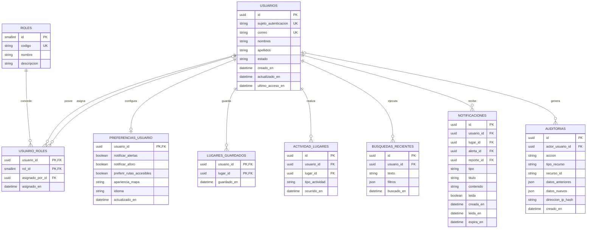
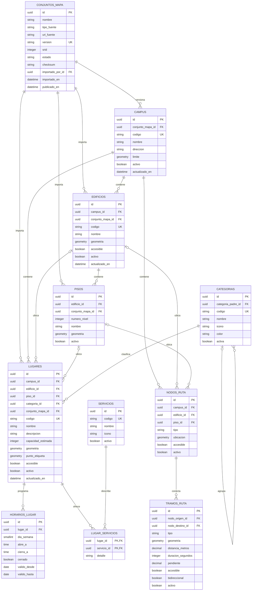
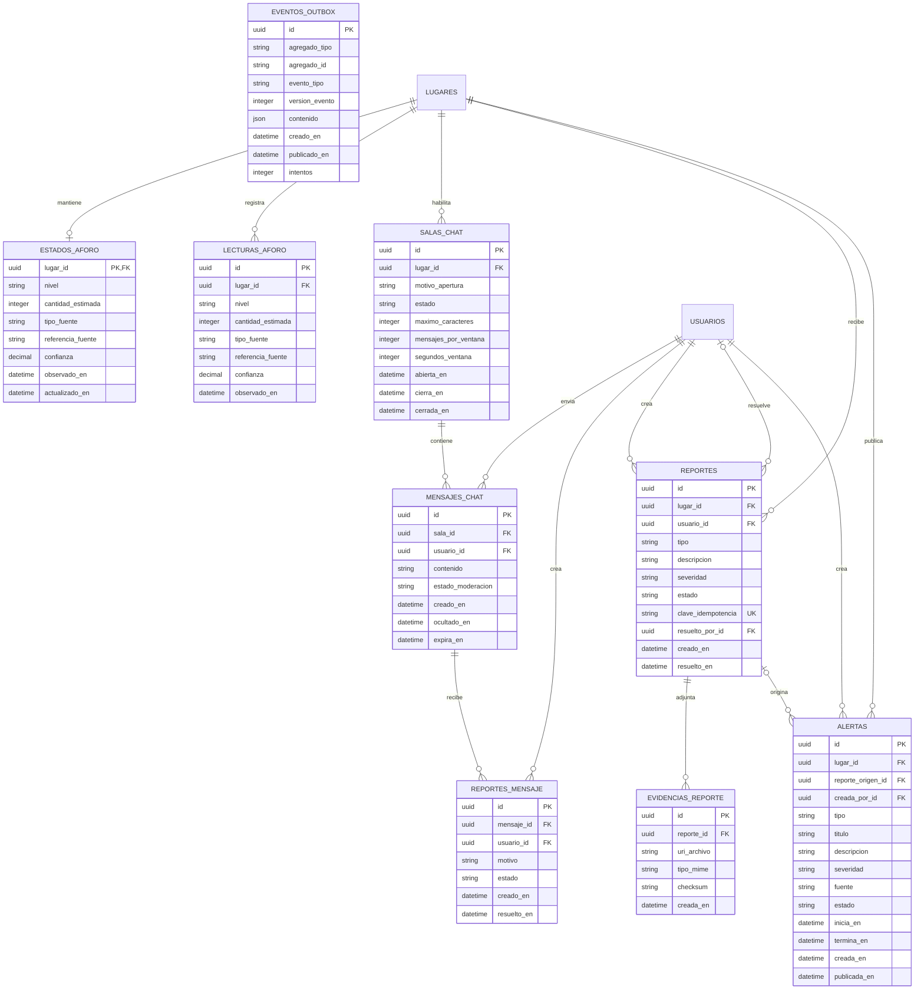

# Base de datos de MAPUC

## 1. Motor y convenciones

MAPUC utiliza PostgreSQL con PostGIS. El modelo esta dividido en tres diagramas Mermaid para mantenerlo legible, pero todas las entidades pertenecen a la misma base de datos.

Convenciones:

- nombres en español;
- tablas y columnas en `snake_case`;
- sin tildes ni la letra `ñ` en identificadores;
- claves primarias UUID, salvo catalogos pequenos;
- fechas almacenadas con zona horaria;
- geometria bajo un SRID definido durante la importacion;
- contrasenas y tokens no se almacenan en esta base; pertenecen al proveedor OIDC.

## 2. Identidad, preferencias y actividad



`tipo_actividad` admite inicialmente `VISTO`, `RUTA_INICIADA` y `VISITADO`. Los lugares frecuentes se calculan mediante agregacion; no se necesita una tabla duplicada.

## 3. Cartografia, lugares y rutas



Los campos `edificio_id` y `piso_id` de `LUGARES` son opcionales porque areas verdes, estacionamientos y accesos pueden estar al aire libre. Los nodos y tramos permiten calcular rutas normales, accesibles y transiciones mediante escaleras, rampas o ascensores.

## 4. Aforo, chat, reportes y alertas



El diagrama referencia `USUARIOS` y `LUGARES`, definidos en los diagramas anteriores.

## 5. Catalogos y restricciones

Los estados se implementan con `CHECK`, tablas catalogo o enums de PostgreSQL segun la frecuencia de cambio. Valores iniciales:

| Campo | Valores |
|---|---|
| `usuarios.estado` | `ACTIVO`, `SUSPENDIDO`, `ELIMINADO` |
| `roles.codigo` | `USUARIO`, `MODERADOR`, `ADMINISTRADOR` |
| `conjuntos_mapa.tipo_fuente` | `CAD`, `GEOJSON`, `ARCGIS`, `OTRO` |
| `conjuntos_mapa.estado` | `CARGADO`, `VALIDANDO`, `RECHAZADO`, `LISTO`, `PUBLICADO`, `RETIRADO` |
| `estados_aforo.nivel` | `VACIO`, `POCO`, `MEDIO`, `ALTO`, `LLENO`, `SIN_INFORMACION` |
| `tipo_fuente` de aforo | `SENSOR`, `OFICIAL`, `COMUNIDAD`, `ESTIMACION` |
| `salas_chat.estado` | `PROGRAMADA`, `ABIERTA`, `SUSPENDIDA`, `CERRADA` |
| `mensajes_chat.estado_moderacion` | `VISIBLE`, `REPORTADO`, `OCULTO`, `ELIMINADO` |
| `reportes.estado` | `RECIBIDO`, `EN_REVISION`, `VALIDADO`, `RECHAZADO`, `RESUELTO` |
| `alertas.estado` | `BORRADOR`, `PROGRAMADA`, `ACTIVA`, `FINALIZADA`, `CANCELADA` |
| `alertas.fuente` | `OFICIAL`, `COMUNIDAD_VALIDADA` |

Restricciones importantes:

- `capacidad_estimada >= 0`.
- `cantidad_estimada >= 0` cuando no sea nula.
- `confianza` entre 0 y 1.
- `dia_semana` entre 1 y 7.
- `maximo_caracteres` no mayor a 300 en la configuracion inicial.
- una sala abierta debe tener `abierta_en` y una politica de cierre.
- `termina_en` debe ser posterior a `inicia_en`.
- un tramo debe conectar nodos distintos y tener distancia positiva.
- una alerta comunitaria requiere un reporte validado.

## 6. Indices recomendados

### Geoespaciales

```sql
CREATE INDEX idx_campus_limite_gist ON campus USING GIST (limite);
CREATE INDEX idx_edificios_geometria_gist ON edificios USING GIST (geometria);
CREATE INDEX idx_lugares_geometria_gist ON lugares USING GIST (geometria);
CREATE INDEX idx_nodos_ruta_ubicacion_gist ON nodos_ruta USING GIST (ubicacion);
CREATE INDEX idx_tramos_ruta_geometria_gist ON tramos_ruta USING GIST (geometria);
```

### Busqueda y filtros

```sql
CREATE INDEX idx_lugares_nombre_trgm
ON lugares USING GIN (nombre gin_trgm_ops);

CREATE INDEX idx_lugares_categoria_activo
ON lugares (categoria_id, activo);

CREATE INDEX idx_lugares_edificio_piso
ON lugares (edificio_id, piso_id);
```

### Tiempo y actividad

```sql
CREATE INDEX idx_lecturas_aforo_lugar_fecha
ON lecturas_aforo (lugar_id, observado_en DESC);

CREATE INDEX idx_mensajes_chat_sala_fecha
ON mensajes_chat (sala_id, creado_en DESC);

CREATE INDEX idx_reportes_estado_fecha
ON reportes (estado, creado_en DESC);

CREATE INDEX idx_alertas_estado_periodo
ON alertas (estado, inicia_en, termina_en);

CREATE INDEX idx_notificaciones_usuario_no_leida
ON notificaciones (usuario_id, creada_en DESC)
WHERE leida = FALSE;
```

## 7. Particionamiento y retencion

No se particionan tablas pequenas por anticipado. Cuando las mediciones lo justifiquen:

- `lecturas_aforo`: particion mensual por `observado_en`;
- `mensajes_chat`: particion mensual por `creado_en` y eliminacion segun retencion;
- `auditorias`: particion mensual o trimestral;
- `actividad_lugares`: particion temporal si crece de forma sostenida;
- `eventos_outbox`: limpieza de eventos publicados despues del periodo de auditoria.

La retencion exacta debe aprobarse con responsables de privacidad y seguridad. Ocultar un mensaje en la aplicacion no equivale automaticamente a borrarlo de auditoria.

## 8. Datos que no se guardan directamente

- contrasenas, refresh tokens o secretos de Keycloak;
- presencia WebSocket permanente: se mantiene temporalmente en Redis;
- archivos CAD o fotografias binarias: se guardan en object storage y la base conserva URI y checksum;
- teselas PMTiles: se distribuyen desde storage/CDN;
- rutas calculadas para cada consulta: se calculan desde el grafo y solo se cachean si aporta valor;
- conteo de usuarios conectados como dato historico exacto, salvo que se diseñe una metrica agregada especifica.
