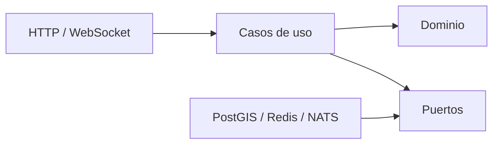
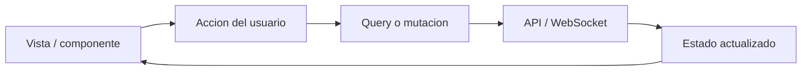
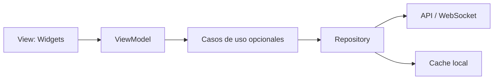

# Patrones de diseno de MAPUC

## 1. Criterio de seleccion

MAPUC no necesita aplicar un unico patron a todo el sistema. Web, backend y futura app movil resuelven problemas diferentes. Se eligen patrones que facilitan mantenimiento, pruebas y escalamiento sin convertir el proyecto en una implementacion innecesariamente compleja de Clean Architecture.

| Capa | Patron principal |
|---|---|
| Backend NestJS | Arquitectura hexagonal dentro de un monolito modular |
| Web React | Componentes por funcionalidad y flujo unidireccional de datos |
| Futuro mobile Flutter | MVVM con Repository |
| Procesos de aforo, chat y alertas | Event-driven y Publish/Subscribe |

## 2. Backend: arquitectura hexagonal

### Objetivo

Separar las reglas de MAPUC de NestJS, PostgreSQL, Redis, NATS, HTTP y WebSocket. NestJS ensambla las dependencias, pero el dominio no depende del framework.



### Capas de cada modulo

```text
modulo/
├── domain/
│   ├── entities/
│   ├── value-objects/
│   ├── events/
│   └── services/
├── application/
│   ├── use-cases/
│   ├── ports/
│   └── dto/
├── infrastructure/
│   ├── persistence/
│   ├── cache/
│   ├── messaging/
│   └── providers/
└── presentation/
    ├── http/
    └── websocket/
```

### Regla de dependencias

- `domain` no importa ninguna otra capa.
- `application` depende de `domain` y de abstracciones propias.
- `infrastructure` implementa puertos de `application`.
- `presentation` transforma HTTP/WebSocket en comandos o consultas de aplicacion.
- Los modulos se comunican mediante casos de uso publicos o eventos, no accediendo a repositorios ajenos.

## 3. Patrones usados en el backend

### Repository

Oculta la persistencia detrás de interfaces como:

```ts
export interface RepositorioLugares {
  buscar(criterios: CriteriosBusqueda): Promise<ResultadoPaginado<Lugar>>;
  obtenerPorId(id: string): Promise<Lugar | null>;
  guardar(lugar: Lugar): Promise<void>;
}
```

La implementacion puede usar TypeORM, consultas SQL espaciales o una vista de lectura sin modificar el caso de uso.

### Adapter

Integra servicios externos o infraestructura:

- `AdaptadorPostgisLugares`;
- `AdaptadorRedisAforo`;
- `AdaptadorNatsEventos`;
- `AdaptadorR2Archivos`;
- `AdaptadorKeycloakIdentidad`.

### Strategy

Se usa cuando una regla tiene varias implementaciones. Ejemplos:

- fuente de aforo: sensor, personal autorizado o comunidad;
- algoritmo de ruta: normal o accesible;
- moderacion: reglas locales o servicio externo;
- importacion cartografica: CAD, GeoJSON o ArcGIS.

### Factory

Crea estrategias o adaptadores a partir del tipo de fuente sin llenar los casos de uso con condicionales.

```text
FabricaImportadores
├── ImportadorCad
├── ImportadorGeoJson
└── ImportadorArcGis
```

### Observer / Publish-Subscribe

Las actualizaciones de aforo, chat y alertas se distribuyen mediante NATS. Los productores no conocen las replicas WebSocket que consumiran el evento.

### Transactional Outbox

Una escritura de negocio y el registro de su evento se confirman en la misma transaccion de PostgreSQL. Un worker publica despues el evento en NATS y marca el registro como procesado.

Se aplica en operaciones donde perder el evento seria importante, por ejemplo:

- publicacion de una alerta;
- validacion de un reporte;
- apertura o cierre de una sala;
- publicacion de una version del mapa.

### Guard

Los guards de NestJS aplican autenticacion, roles y permisos antes de ejecutar el controlador. No reemplazan las validaciones de propiedad o estado dentro del caso de uso.

### Circuit Breaker, timeout y retry

Las llamadas externas tienen timeout. Los reintentos se reservan para operaciones idempotentes y usan espera incremental. El circuit breaker evita acumular solicitudes cuando Keycloak, storage u otro proveedor presenta fallos.

### Idempotency

Los reportes, operaciones administrativas y consumidores de eventos usan claves de idempotencia para no duplicar acciones ante reintentos.

## 4. Patron web: componentes por funcionalidad y flujo unidireccional

React ya usa composicion de componentes. MAPUC organizara el frontend por funcionalidades, no por tipos globales de archivo.



### Responsabilidades

- **TanStack Query:** estado remoto, cache, reintentos controlados e invalidacion.
- **Zustand:** estado local compartido de interfaz, como paneles, filtros temporales y seleccion del mapa.
- **Estado local React:** estado efimero exclusivo de un componente.
- **React Hook Form + Zod:** formularios y validacion de entrada.
- **WebSocket adapter:** convierte eventos del servidor en acciones tipadas para las funcionalidades.

### Patrones complementarios en web

#### Container / Presentational

Los componentes contenedores obtienen datos y coordinan acciones. Los componentes de presentacion reciben propiedades y emiten eventos. No es obligatorio separar cada componente en dos archivos; se aplica cuando mejora pruebas o reutilizacion.

#### Adapter

Los DTO de la API no llegan directamente a toda la interfaz. Un adaptador los convierte a modelos de vista, especialmente para:

- coordenadas y geometria;
- estados de aforo;
- fechas y horarios;
- fuentes oficiales o comunitarias;
- mensajes y estados de moderacion.

#### Compound Components

Se usa en componentes complejos como paneles, tablas, filtros y bottom sheets para evitar APIs con demasiadas propiedades.

#### State Machine limitada

Flujos con estados estrictos se modelan explicitamente, aunque no requieren una libreria desde el inicio:

```text
chat: cerrado -> disponible -> conectado -> limitado -> suspendido
reporte: editando -> enviando -> confirmado | error | bloqueado
ruta: sin_ruta -> calculando -> lista -> en_recorrido -> finalizada
```

Si estos flujos crecen, se puede incorporar XState sin cambiar la organizacion general.

## 5. Patron mobile futuro: MVVM con Repository

Para Flutter se recomienda MVVM porque separa widgets, estado de pantalla y acceso a datos sin replicar toda la arquitectura del backend.



### Capas

- **View:** widgets y navegacion; no ejecuta HTTP ni SQL.
- **ViewModel:** estado, validaciones de presentacion y acciones de usuario.
- **Repository:** combina API, WebSocket y cache local.
- **Use cases:** se agregan solo para procesos reutilizados o con reglas relevantes, como calcular filtros, reportar o gestionar una ruta.

La implementacion puede usar Riverpod para crear y observar ViewModels.

### Por que no usar exactamente el mismo patron que en web

Web y Flutter comparten requisitos y contratos, no frameworks ni ciclos de vida. React funciona naturalmente con componentes y flujo unidireccional; Flutter se beneficia de ViewModels observables y repositorios con soporte offline. Forzar nombres y capas identicas generaria abstracciones artificiales.

## 6. Patrones de datos y consultas

### Read Model ligero

Las vistas de busqueda y mapa necesitan datos preparados: nombre, categoria, ubicacion, distancia, horario y aforo. Se permiten consultas de lectura optimizadas que no reconstruyan toda la entidad de dominio.

Esto es **CQRS ligero**, no una implementacion completa de CQRS:

- los comandos mantienen reglas y transacciones;
- las consultas pueden usar SQL o vistas optimizadas;
- no existen dos bases de datos obligatorias ni buses separados para cada operacion.

### Cache-aside

La aplicacion consulta Redis antes de calcular o leer datos costosos. Ante un miss, obtiene la informacion de la fuente persistente y actualiza el cache con expiracion.

No se cachean respuestas que contengan informacion privada sin una clave y una politica adecuadas.

## 7. Patrones que no se aplicaran inicialmente

- Clean Architecture completa en cada pantalla o CRUD.
- Microservicios por entidad.
- Event Sourcing.
- CQRS completo.
- Singleton manual para dependencias administradas por NestJS.
- Un store global para todo el estado de React.
- Active Record dentro de las entidades de dominio.

## 8. Guia de seleccion rapida

| Necesidad | Patron |
|---|---|
| Cambiar PostGIS, Redis o proveedor externo | Port + Adapter |
| Probar reglas sin infraestructura | Arquitectura hexagonal |
| Varias fuentes de aforo o mapas | Strategy + Factory |
| Entregar eventos a varias replicas | Publish/Subscribe |
| Guardar y publicar sin perder eventos | Transactional Outbox |
| Evitar duplicados por reintentos | Idempotency |
| Organizar una funcionalidad React | Feature-based + flujo unidireccional |
| Estado remoto en web | TanStack Query |
| Estado de una pantalla Flutter | MVVM |
| Combinar remoto y cache local mobile | Repository |
