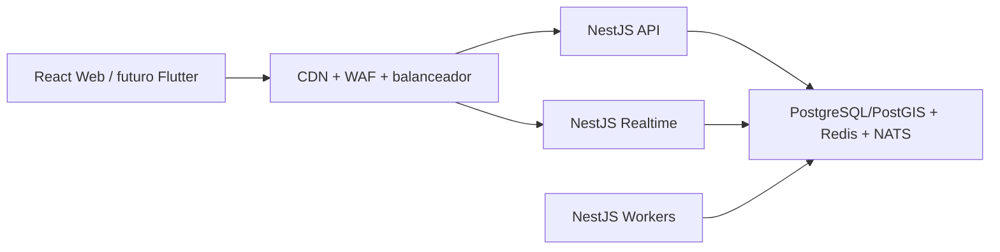

# MAPUC

MAPUC es una plataforma digital de mapa, busqueda y orientacion para el campus de la Pontificia Universidad Catolica del Peru (PUCP). Su objetivo es ayudar a estudiantes, docentes, personal, visitantes y futuros postulantes a localizar espacios, conocer su nivel de aforo y desplazarse por el campus de forma clara y accesible.

La primera version sera una aplicacion web responsive y preparada como PWA. Si el producto se valida, se incorporara una aplicacion movil que utilizara el mismo backend.

## Problema

Un campus universitario contiene facultades, aulas, bibliotecas, areas verdes, servicios, espacios de estudio y zonas administrativas que pueden ser dificiles de localizar. Los mapas estaticos tampoco reflejan cambios de aforo, incidencias, horarios, accesibilidad ni rutas interiores.

MAPUC centraliza esta informacion en una experiencia similar a una aplicacion de mapas, pero especializada en la PUCP.

## Funcionalidades

### Usuarios

- Registro, inicio de sesion, recuperacion y verificacion de cuenta.
- Integracion futura con correo y SSO PUCP.
- Perfil, preferencias de notificaciones, privacidad y accesibilidad.
- Lugares guardados, vistos recientemente y busquedas recientes.

### Mapa y busqueda

- Mapa interactivo del campus.
- Busqueda de facultades, edificios, aulas, bibliotecas, areas verdes, coworking, cafeterias, baños, deportes y servicios.
- Filtros por categoria, edificio, piso, horario, accesibilidad, distancia y aforo.
- Mapas interiores y selector de piso donde exista informacion.
- Rutas peatonales normales y accesibles.
- Distribucion optimizada del mapa mediante teselas vectoriales.

### Aforo

- Estados: vacio, poca afluencia, afluencia media, alta afluencia, lleno y sin informacion.
- Diferenciacion entre datos oficiales, sensores, estimaciones y reportes comunitarios.
- Ultima hora de actualizacion y nivel de confianza cuando corresponda.
- Alternativas cercanas con menor aforo.

### Chat temporal

- Disponible solo cuando un lugar tiene alta afluencia, esta lleno o presenta una incidencia activa.
- Maximo 300 caracteres por mensaje.
- Maximo 5 mensajes por minuto por usuario en la configuracion inicial.
- Visualizacion de los ultimos 100 mensajes.
- Cooldown, moderacion, reporte de contenido y cierre de salas.

El chat sirve para compartir informacion util del lugar; no pretende funcionar como una red social.

### Reportes y alertas

- Reportes de lugar lleno o vacio, aforo incorrecto, acceso bloqueado, incidente, servicio no disponible e informacion incorrecta.
- Evidencia opcional y proteccion contra reportes repetidos.
- Alertas activas, actualizaciones de aforo, avisos del campus y seguimiento de reportes.
- Validacion administrativa antes de convertir un reporte comunitario en alerta oficial.

### Administracion

- Gestion de lugares, categorias, servicios y horarios.
- Monitoreo y actualizacion de aforo.
- Revision y resolucion de reportes.
- Creacion y programacion de alertas.
- Moderacion de salas, mensajes y usuarios.
- Importacion y publicacion de versiones cartograficas.
- Metricas y auditoria de acciones.

## Arquitectura resumida

MAPUC adopta una arquitectura cliente-servidor distribuida:



El backend es un monolito modular organizado con arquitectura hexagonal. Produce aplicaciones separadas para API REST, WebSocket y workers, de modo que cada carga pueda escalar sin comenzar con decenas de microservicios.

## Stack principal

| Capa | Tecnologias |
|---|---|
| Web | React, TypeScript, Vite, TanStack Query, Zustand |
| UI | Tailwind CSS, shadcn/ui, Radix UI |
| Mapas | MapLibre GL JS, PostGIS, PMTiles/MVT |
| Backend | NestJS, Fastify, TypeScript, WebSocket |
| Persistencia | PostgreSQL + PostGIS, TypeORM y SQL espacial |
| Cache | Redis |
| Eventos | NATS JetStream + Transactional Outbox |
| Identidad | Keycloak, OpenID Connect y PKCE |
| Archivos | Cloudflare R2 o storage S3 compatible + CDN |
| Local | Docker Compose |
| Produccion | Kubernetes administrado cuando la carga lo justifique |
| Observabilidad | OpenTelemetry, Prometheus, Grafana, Loki y Sentry |
| Pruebas | Jest, Vitest, Playwright, Testcontainers y k6 |

## Documentacion

- [Arquitectura](docs/ARQUITECTURA.md)
- [Patrones de diseno](docs/PATRONES-DE-DISENO.md)
- [Stack tecnologico](docs/STACK-TECNOLOGICO.md)
- [Estructura de carpetas](docs/ESTRUCTURA-DE-CARPETAS.md)
- [Base de datos](docs/BASE-DE-DATOS.md)
- [Instrucciones para agentes](AGENTS.md)

## Estructura esperada

```text
mapuc/
├── backend/
├── frontend/
├── contracts/
├── infrastructure/
├── scripts/
├── tests/
├── docs/
├── .github/
├── AGENTS.md
├── docker-compose.yml
└── README.md
```

La estructura completa se detalla en [docs/ESTRUCTURA-DE-CARPETAS.md](docs/ESTRUCTURA-DE-CARPETAS.md).

## Requisitos de desarrollo previstos

- Node.js LTS.
- npm.
- Docker Desktop o Docker Engine con Compose.
- Git.
- Un navegador moderno con WebGL.

Kubernetes, Terraform y herramientas GIS pesadas no son obligatorios para editar la interfaz o ejecutar pruebas unitarias locales.

## Inicio local previsto

El repositorio de codigo debera exponer scripts equivalentes a los siguientes cuando sea inicializado:

```bash
npm ci
docker compose up -d
npm run dev
```

Servicios locales esperados:

- PostgreSQL con PostGIS;
- Redis;
- NATS JetStream;
- Keycloak;
- API NestJS;
- gateway realtime NestJS;
- workers NestJS;
- frontend React.

Los puertos y variables definitivos se documentaran en `.env.example` y `docker-compose.yml`. No se deben copiar secretos reales al repositorio.

## Calidad

Antes de integrar un cambio:

```bash
npm run lint
npm run typecheck
npm test
npm run test:integration
npm run test:e2e
npm run build
```

Los nombres exactos deben coincidir con los scripts reales de cada `package.json`.

## Rendimiento

La meta de aproximadamente 100 000 usuarios conectados simultaneamente no se considera cumplida por elegir NestJS, Fastify, Redis o Kubernetes. Debe demostrarse mediante pruebas de carga en un entorno representativo.

El plan incluye:

- servir web y teselas desde CDN;
- escalar API y WebSocket de forma independiente;
- limitar suscripciones a zonas o lugares relevantes;
- compartir eventos mediante NATS;
- usar Redis para presencia y limites;
- usar PgBouncer para controlar conexiones a PostgreSQL;
- medir HTTP, WebSocket, reconexiones, latencia p95/p99, CPU y memoria con k6.

## Seguridad y privacidad

- Autenticacion OIDC con PKCE.
- Autorizacion mediante roles y permisos.
- TLS, CORS restringido, WAF y rate limiting.
- No almacenar contrasenas en la base de MAPUC.
- No registrar tokens ni datos personales innecesarios.
- Archivos de evidencia validados y almacenados fuera de PostgreSQL.
- Acciones administrativas auditables.
- Politicas de retencion para chat, actividad y evidencias.

## Accesibilidad

- Contraste WCAG AA.
- Navegacion por teclado y foco visible.
- Controles de mapa con etiquetas accesibles.
- Estados de aforo comunicados con texto e iconos, no solo color.
- Rutas accesibles como opcion prioritaria.
- Diseño responsive para escritorio, tablet y movil.

## Estado del proyecto

El proyecto se encuentra en etapa de definicion y prototipado. Este conjunto de documentos establece la base tecnica; no representa todavia una implementacion desplegada ni certifica la capacidad de 100 000 conexiones.

## Licencia

La licencia debe definirse con la PUCP y los responsables del proyecto antes de publicar codigo, mapas, planos o datos institucionales. No se debe asumir que la cartografia o la identidad visual pueden distribuirse publicamente.
